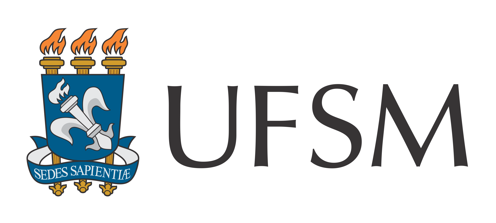
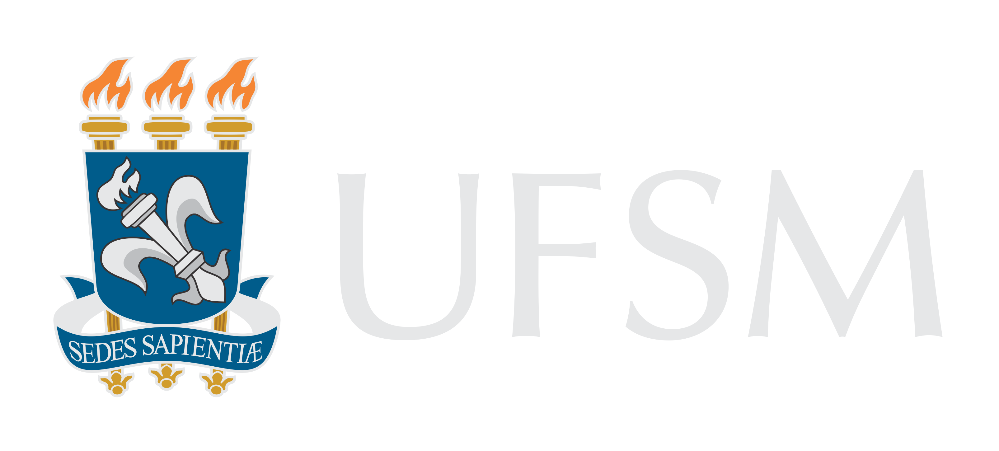

# Credits

Numav was developed by the following members of the [Acoustic Engineering Program](https://www.eac.ufsm.br/) at the [Federal University of Santa Maria (UFSM)](https://www.ufsm.br/) in Brazil:
```@raw html
<ul>
  <li>
    <a href="https://github.com/mmfiuza">
      <span style="position: relative; display: inline-block; vertical-align: -0.2em; width: 1.5em; height: 1.2em;">
        
        
      </span>
    </a>
    <a href="https://www.researchgate.net/profile/Matheus-Fiuza"></a> Matheus Machado Fiuza;
  </li>

  <li>
    <a href="https://github.com/paulomareze">
      <span style="position: relative; display: inline-block; vertical-align: -0.2em; width: 1.5em; height: 1.2em;">
        
        
      </span>
    </a>
    <a href="https://www.researchgate.net/profile/Paulo-Mareze"></a> Paulo Henrique Mareze;
  </li>

  <li>
    <a href="https://github.com/PedroPauloCalmon">
      <span style="position: relative; display: inline-block; vertical-align: -0.2em; width: 1.5em; height: 1.2em;">
        
        
      </span>
    </a>
    <a href="https://www.researchgate.net/profile/Pedro-Paulo-Paes"></a> Pedro Paulo Calmon Paes.
  </li>
</ul>
```

```@raw html
<div style="display: flex; align-items: center; gap: 2rem;">
  
  
  
  
</div>
```
